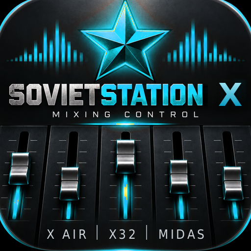

# SovietStation X

Управление цифровым микшером с планшета. Behringer X32 и X Air, Midas M32 и MR —
по Wi-Fi, без облаков и без регистрации.

**[Скачать последнюю версию →](../../releases/latest)**

---

## Какие пульты

| Семейство | Модели | Связь |
|---|---|---|
| Behringer X32 · Midas M32 | X32, Compact, Producer, Rack, Core, M32, M32R, M32C, M32 Live | OSC, UDP 10023 |
| Behringer X Air · Midas MR | XR12, XR16, XR18, X18, MR12, MR16, MR18 | OSC, UDP 10024 |

M32 и MR — та же платформа, что X32 и X Air, поэтому работают так же.

## Что умеет

* Микшерный стол: фейдеры, mute, соло, панорама, имена и цвета каналов, DCA и
  группы мьютов.
* Канал целиком: преамп, фильтр, гейт, компрессор, четырёхполосный EQ,
  инсерты, назначения.
* Посылы: по каналу и по шине, в том числе матрицы.
* Эффекты: тип слота, параметры, уровни посыла и возврата, графический EQ.
* Анализатор: с пульта или с микрофона планшета, со спектрограммой.
* Сцены: сохранение и загрузка на пульте, локальные снимки.
* Проигрыватель фонограмм: плеер на компьютере, которым управляют с того же
  планшета, по той же сети.

## Что нужно

* Android 7.0 или новее. Удобнее на планшете от 8 дюймов, но работает и на
  телефоне.
* Планшет и пульт в одной сети Wi-Fi. Пульт по кабелю в тот же роутер — тоже
  одна сеть.
* Ничего больше: ни аккаунта, ни интернета, ни подписки.

## Установка

Приложения нет в Google Play, поэтому ставится файлом.

1. Скачайте `SovietStation-X-<версия>.apk` со страницы
   [релизов](../../releases/latest).
2. Откройте файл. Android спросит разрешение ставить приложения из этого
   источника (браузера или файлового менеджера) — разрешите.
3. Play Protect может предупредить, что приложение неизвестно. Это значит ровно
   то, что написано: оно не из магазина. Нажмите «Всё равно установить».
4. Готово. Иконка появится в списке программ.

Обновление ставится поверх, настройки и сцены сохраняются. Удалять старую
версию не нужно и не стоит.

## Если что-то пошло не так

Приложение само записывает отчёт о сбое. Если оно закрылось:

1. Запустите его снова.
2. На первом экране будет красная панель **«Прошлый запуск завершился сбоем»**.
3. Нажмите **«Отправить отчёт»** и пришлите текст — или просто снимите
   скриншот этой панели.

В отчёте только техническая часть: модель Android, место в коде и строка
ошибки. Ни ваших настроек, ни имён каналов, ни адресов там нет.

Баги и пожелания — во вкладке [Issues](../../issues).

## Про данные

Приложение разговаривает только с пультом в вашей локальной сети и, если вы
его включите, с плеером на вашем компьютере. Наружу не уходит ничего:
аналитики нет, аккаунтов нет, в интернет оно не ходит вовсе.

Разрешение на микрофон спрашивается только когда вы сами переключаете
анализатор на микрофон планшета. Звук при этом никуда не пишется и не
отправляется — он нужен, чтобы нарисовать спектр.

## Честно о состоянии

Это рабочий инструмент, которым пользуются на концертах, но пишет его один
человек, и проверить все модели на живом железе невозможно. Перед первым
выступлением прогоните приложение на своём пульте в спокойной обстановке.

Есть и полная редакция — с Behringer WING, Allen & Heath Qu и CQ, Yamaha CL.
Там поддержка разной зрелости, поэтому она раздаётся отдельно.

## Лицензия

Приложение бесплатное. Исходный код закрыт; здесь публикуются только сборки.
